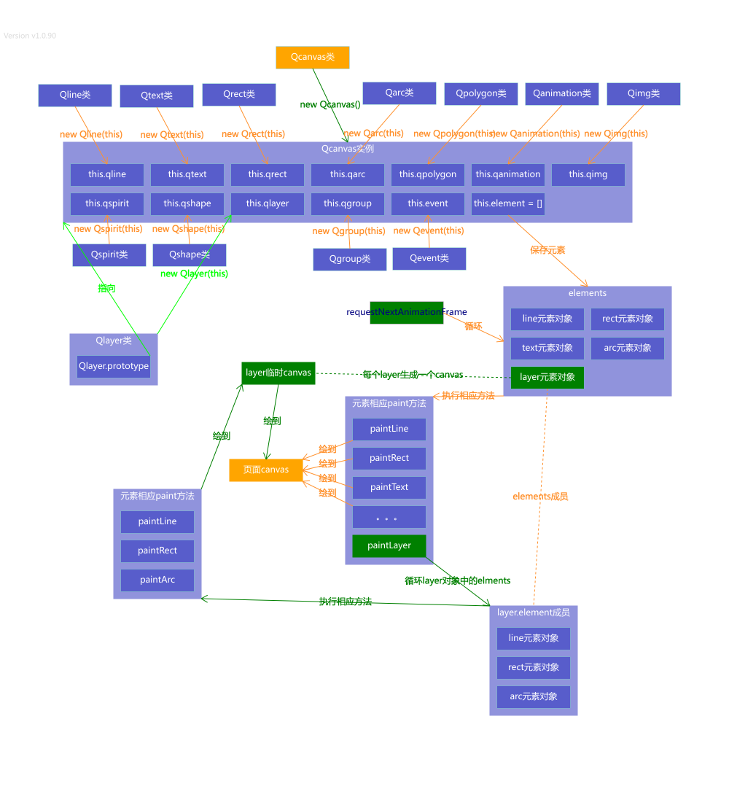

# Qcanvas API v1.0

Qcanvas API说明文档

基础功能的开发计划  
Qcanvas主类 随时完善  
元素类

> Qline类 基本功能完成  
> Qtext类 基本功能完成  
> Qrect类 基本功能完成  
> Qarc类 基本功能完成  
> Qpolygon类 基本功能完成  
> Qshape类 基本功能完成  
> Qimg类 基本功能完成  
> Qspirit类 基本功能完成

容器类

> Qlayer类 基本功能完成  
> Qgroup类 基本功能完成

功能类

> Qanimation类 基本完成  
> Qevent类 基本完成
>
> **元素的拖动**  
> 当前版本v1.0中，如果某个元素创建时的初始位置数据是依赖其它元素的（位置是通过一个函数返回的）  
> 那么一旦它被拖动，那么它的位置数据就会变成数值型 和依赖元素就会断开联系 切记这点
>
> 如果一个元素的属性display:none 该元素上的事件不会执行 因为不会画在画布上  
> 如果一个元素的属性pointerEvent:'none' 该元素上的事件不会响应
>
> **动画**  
> 当isLoop = true时，动画每次执行到结束位置都会执行finished方法  
> 当isLoop是数值时，动画一直执行指定次数时才会执行finished方法

Qlayer元素类

> 实质上是一个**抽象**的元素容器类 为了容纳其它元素。（宽高和主画布一样）  
> 1、当我们不使用Qlayer时 元素直接画在主画布上；  
> 2、当使用Qlayer时 Qcanvas会先创建一个临时的canvas画布 把指定要放到该Qlayer容器内的元素先画这个临时canvas上，最后在requestNextAnimationFrame的下一个循环时再把这个画布画到主画布上  当然临时canvas也在requestNextAnimationFrame控制下不停的重绘 所以现在框架实现的这些元素\(除Qlayer和Qgroup\)都可以指定到一个Qlayer对象上  
> 3、使用Qlayer元素的好处：可以一次性控制一批元素的显示、隐藏、删除、层级关系等  
> 4、删除Qlayer元素 会同时删除它所容纳的所有元素  
> 5、在Qlayer里的所有元素层级关系都是基于该Qlayer实例的。  
> Qcanvas的以下方法 对Qlayer元素容器内的元素无效 如果需要调整层级关系 需要调用Qlayer的相应方法

| 方法 | 备注 |
| :--- | :--- |
| lower | 把元素降低一个层级 \(参数为元素对象\) |
| lowerToBottom | 把元素层级置底\(参数为元素对象\) |
| raise | 把元素提高一个层级\(参数为元素对象\) |
| raiseToTop | 把元素层级置顶\(参数为元素对象\) |

框架引入方法

> ##### 方法一
>
> npm安装
>
> > 安装依赖：npm install qcanvas  
> > 页面导入：  import {Qcanvas} from 'qcanvas';
>
> ##### 方法二
>
> 使用script标签直接引用

Qcanvas整体架构图

