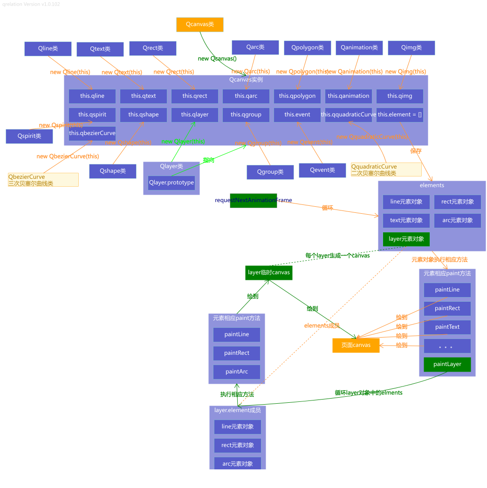

# Qcanvas API v1.x

Qcanvas API说明文档

2021-09-06 Qcanvas 2.0初版已经开发完毕, 功能保持和1.x的同步，死了不少脑细胞，因为是基于1.x的，所以花费时间少一点，大约花了40多个小时 （包括示例测试），

地址：https://github.com/zhicheng99/qcanvas

注：v1.x以后不再增加新功能   

两个版本主要区别如下

| 序号 | 区别点                       | v1.x                                                         | v2.0                                                         |
| ---- | ---------------------------- | ------------------------------------------------------------ | ------------------------------------------------------------ |
| 1    | 画布初始化                   | new Qcanvas(["qcanvas",300,200]);			或			 new Qcanvas({				 id:'qcanvas', 				width:300, 				height:200 			}) | new Qcanvas({				id:'qcanvas', 				width:300, 				height:200 			}) |
| 2    | 线段实始化                   | qcanvas.qline.line(...options)                               | qcanvas.line(...options)                                     |
| 3    | 矩形初始化                   | qcanvas.qrect.rect(...options)                               | qcanvas.rect(...options)                                     |
| 4    | 圆初化                       | qcanvas.qarc.arc(..options)                                  | qcanvas.arc(..options)                                       |
| 5    | 图片初始化                   | qcanvas.qimg.img(..options)                                  | qcanvas.img(..options)                                       |
| 6    | 文字初化                     | qcanvas.qtext.text(...options)                               | qcanvas.text(...options)                                     |
| 7    | shape初始化                  | qcanvas.qshape.shape(..options)                              | qcanvas.shape(..options)                                     |
| 8    | polygon初始化                | qcanvas.qpolygon.polygon(...options)                         | qcanvas.polygon(...options)                                  |
| 9    | spirit初始化                 | qcanvas.qspirit.spirit(...options)                           | qcanvas.spirit(...options)                                   |
| 10   | layer初始化                  | qcanvas.qlayer.layer(...options)                             | qcanvas.layer(...options)                                    |
| 11   | group初始化                  | qcanvas.qgroup.group(...options)                             | qcanvas.group(...options)                                    |
| 12   | quadraticCurve二次曲线初始化 | qcanvas.qquadraticCurve.quadraticCurve(...options)           | qcanvas.quadraticCurve(...options)                           |
| 13   | bezierCurve三次曲线初始化    | qcanvas.qbezierCurve.bezierCurve(...options)                 | qcanvas.bezierCurve(...options)                              |
| 14   | animation初始化              | qcanvas.qanimation.animate(...options)                       | qcanvas.animate(...options)                                  |

基础功能的开发计划  
Qcanvas主类 随时完善  
元素类

> Qline类 基本功能完成  
> Qtext类 基本功能完成  
> Qrect类 基本功能完成  
> Qarc类 基本功能完成  
> Qpolygon类 基本功能完成  
> Qshape类 基本功能完成  
> Qimg类 基本功能完成  
> Qspirit类 基本功能完成  
> QquadraticCurve类 基本功能完成  
> QbezierCurve类 基本功能完成

容器类

> Qlayer类 基本功能完成  
> Qgroup类 基本功能完成

功能类

> Qanimation类 基本完成  
> Qevent类 基本完成
>
> **元素的拖动**  
> 当前版本v1.0中，如果某个元素创建时的初始位置数据是依赖其它元素的（位置是通过一个函数返回的）  
> 那么一旦它被拖动，那么它的位置数据就会变成数值型 和依赖元素就会断开联系 切记这点
>
> 如果一个元素的属性display:none 该元素上的事件不会执行 因为不会画在画布上  
> 如果一个元素的属性pointerEvent:'none' 该元素上的事件不会响应
>
> **动画**  
> 当isLoop = true时，动画每次执行到结束位置都会执行finished方法  
> 当isLoop是数值时，动画一直执行指定次数时才会执行finished方法

Qlayer元素类

> 实质上是一个**抽象**的元素容器类 为了容纳其它元素。（宽高和主画布一样）  
> 1、当我们不使用Qlayer时 元素直接画在主画布上；  
> 2、当使用Qlayer时 Qcanvas会先创建一个临时的canvas画布 把指定要放到该Qlayer容器内的元素先画这个临时canvas上，最后在requestNextAnimationFrame的控制下再把这个画布画到主画布上  当然临时canvas也在requestNextAnimationFrame控制下不停的重绘 所以现在框架实现的这些元素\(除Qlayer和Qgroup\)都可以指定到一个Qlayer对象上  
> 3、使用Qlayer元素的好处：可以一次性控制一批元素的显示、隐藏、删除、层级关系等  
> 4、删除Qlayer元素 会同时删除它所容纳的所有元素  
> 5、在Qlayer里的所有元素层级关系都是基于该Qlayer实例的。  
> Qcanvas的以下方法 对Qlayer元素容器内的元素无效 如果需要调整层级关系 需要调用Qlayer的相应方法	

| 方法 | 备注 |
| :--- | :--- |
| lower | 把元素降低一个层级 \(参数为元素对象\) |
| lowerToBottom | 把元素层级置底\(参数为元素对象\) |
| raise | 把元素提高一个层级\(参数为元素对象\) |
| raiseToTop | 把元素层级置顶\(参数为元素对象\) |

set类方法

> 此类方法是根据对象的初始属性自动生成的，给对象赋加自定义的初始属性，也会自动添加相应的方法  
> 格式为 set+属性名称（属性首字母会自动转换为大写）；执行方法时返回当前对象，所以支持链式调用
> 例如一个Qtext对象text可以进行如下操作
> text.setColor('red').setText('hello world');

框架引入方法

> ##### 方法一
>
> npm安装
>
> > 安装依赖：npm install qcanvas  
> > 页面导入：  import {Qcanvas} from 'qcanvas';
>
> ##### 方法二
>
> 使用script标签直接引用

Qcanvas1.x整体架构图

